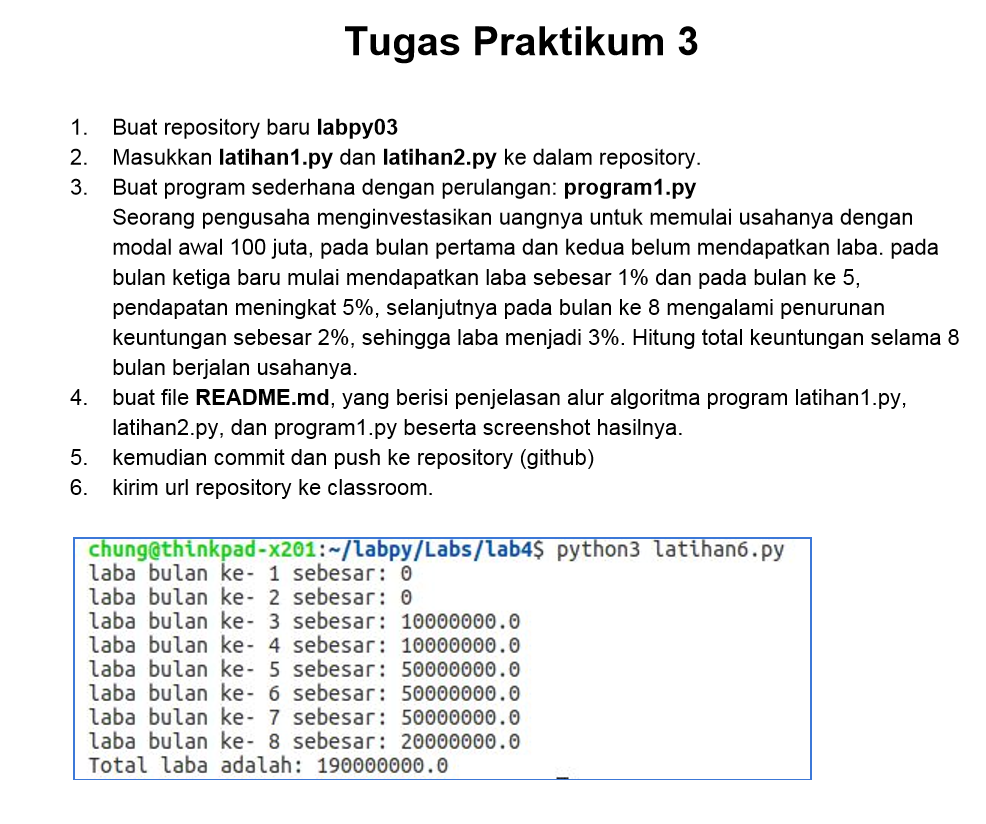
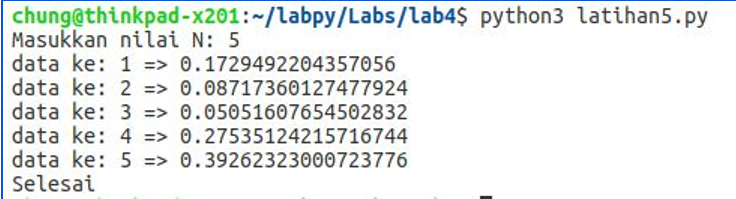
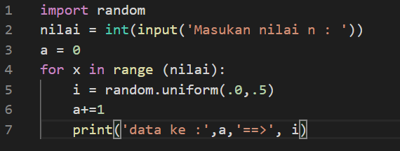
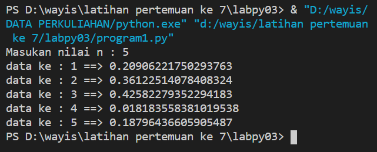
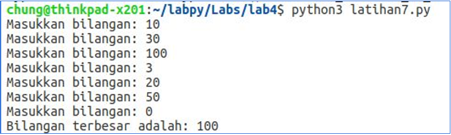
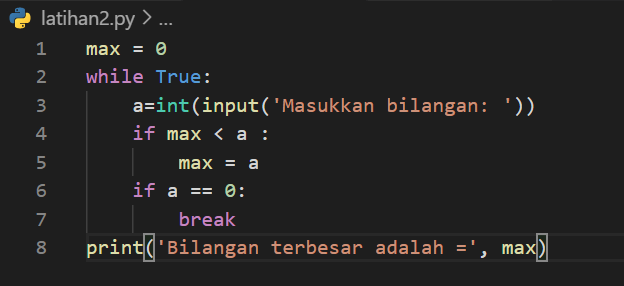
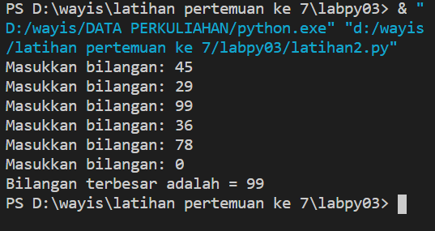
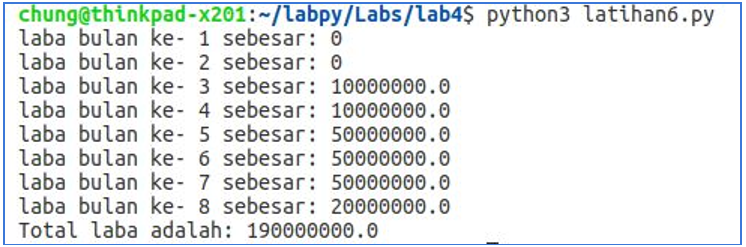
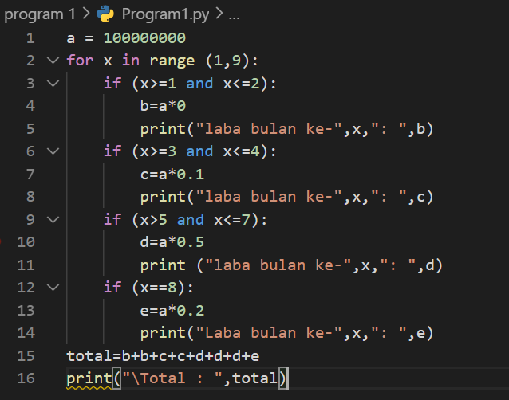
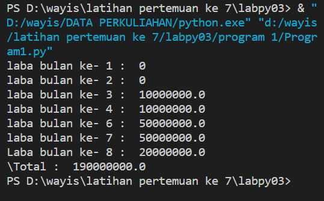

# labpy03

# DAFTAR TUGAS

<table border="2" cellpading="10">
  <tr>
    <td><b>Pertemuan 7</b></td>
    <td>Lab3</td>
    <td><a href="https://github.com/Wayisalqorni/pratikum-python.git">Klik disini</td>
  </tr>
  <tr>
    <td><b>Pertemuan 7</b></td>
    <td>labspy02</td>
    <td><a href="https://github.com/Wayisalqorni/labspy02.git">Klik disini</td>
  </tr>

</table>

## SOAL

## JAWABAN

# Latihan 1: latihan1.py 
1. Tampilkan ​n​ bilangan acak yang lebih kecil dari 0.5.  
2. nilai ​n​ diisi pada saat runtime 
3. anda bisa menggunakan kombinasi ​while​ dan ​for​ untuk menyelesaikannya 
4. gunakan fungsi random() yang dapat diimport terlebih dahulu

Membangkitkan nilai ​random() 
 from​ random ​import​ random a = random() print​(a) 
 

 

 Penjelasan:

* import random berfungsi untuk memanggil library random, dimana random berfungsi untuk menentukan pilihan secara acak
* nilai = int(input('Masukan nilai n : ')) untuk menginputkan nilai  berupa integer
* range() berfungsi menghasilkan list
* masukkan i = random.uniform (.0,.5) di gunakan untuk menampilkan bilangan float random, lalu masukkan a+=1 untuk memberi nomer pada bilangan float.
* print('data ke :',a,'==>', i) untuk menampilkan output data

terminal:

## Latihan 2: latihan2.py 
  Buat program untuk menampilkan bilangan ​terbesar​ dari ​n​ buah data yang diinputkan. Masukkan angka 0 untuk berhenti. 

 

 

 Penjelasan:

* Integer max = 0

* fungsi perulangan while true hingga menampilkan perulangan sampai batas tertentu.

* Memasukan bilangan integer pada "a"

* Menggunakan fungsi if jika max kurang dari nilai a, maka max sama dengan a

* Mengunakan fungsi if jika nilai a adalah 0 maka fungsi break artinya perulangan berhenti jika menulis nilai 0

* Mencetak nilai paling terbesar setelah break, sehingga menampilkan nilai terbesar diantara bilangan tersebut dalam perulangan.

Terminal:

## Program1: Program 1.py
 Buat program sederhana dengan perulangan: ​program1.py Seorang pengusaha menginvestasikan uangnya untuk memulai usahanya dengan modal awal 100 juta, pada bulan pertama dan kedua belum mendapatkan laba. pada bulan ketiga baru mulai mendapatkan laba sebesar 1% dan pada bulan ke 5, pendapatan meningkat 5%, selanjutnya pada bulan ke 8 mengalami penurunan keuntungan sebesar 2%, sehingga laba menjadi 3%. Hitung total keuntungan selama 8 bulan berjalan usahanya.
 
 

 

 Penjelasan:

* Variabel a = 100.000.000 modal awal

* Menggunakan fungsi looping for pada nilai x 1-9 untuk menampilkan bulan 1 sampai bulan 8.

* Menggunakan fungsi if, untuk menghitung laba bulan 1 sampai 8

* Bulan pertama dan kedua laba adalah 0

* Bulan ke 3 dan ke 4 mendapat laba 1% sehingga modal di kali 1% = keuntungan

* Bulan ke 5 mendapatkan laba 5%, sehingga modal dikali 5% = keuntungan

* Bulan ke 8 mendapatkan laba 2% sehingga keuntungan menurun dari bulan sebelumnya, modal dikali 2% = keuntungan.

* Menghitung jumlah total laba dengan menjumlah keuntungan dari bulan ke 1 sampai bulan 8, hasilnya adalah total keuntungan yang didapat total=b+b+c+c+d+d+d+e

* print("\Total : ",total), untuk menampilkan hasil keseluruhan laba dari bulan pertama sampai bulan kedelapan.

Terminal:

 